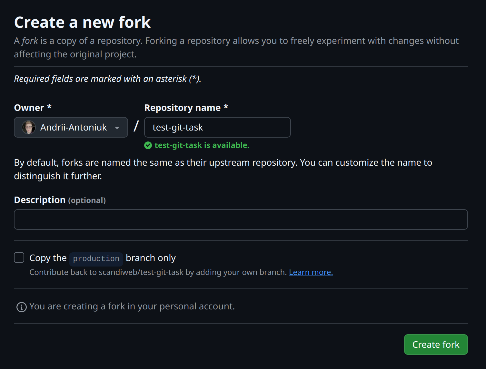
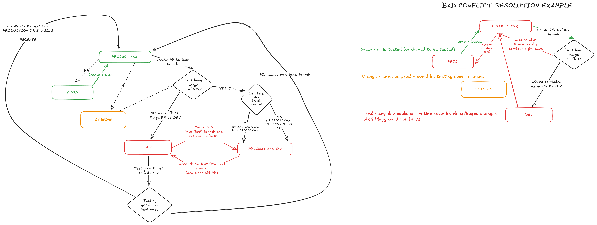

# GIT workflow task

### Prerequisites: Fork the repository
You need to fork this repository to your own GitHub account so you can open PRs and merge without conflicts. Click on the fork button on the top right corner of this repository.

**Make sure to uncheck the *"Copy the production branch only"* option.**

   
Click for image

## Task
You need to install a module from `https://github.com/markshust/magento2-module-disabletwofactorauth`.

### Steps and requirements
#### 1. Follow the workflow from course to install the module.

   
Click for details

   1. **Clone** this repo and setup Magento by running `npm install` and `npm run start`. This is simple CMA app with sample data.
   2. Create a new branch from `production`.
   3. Install the module
   4. Commit the changes
   5. Push the changes to your forked repository
   6. Open a PR to merge the changes to the `dev` branch of your forked repository
   7. Merge the PR (you will need to resolve conflicts) to `dev` branch
   8. Open a PR to merge the changes to the `production` branch of your forked repository
   9. Merge the PR to `production` branch

     
   Image for context:
   
   

#### 2. Expected results:
   1. The module should be installed and working on `production` and `dev` branches.
   2. The `composer.json` and `composer.lock` files should be updated with the new module.
   3. The `composer.lock` file should be *integrable*. This means that the SHA in the `composer.lock` file should be up to date.
   4. The `production` branch **shouldn't have any commits or files** from the `dev` branch.

#### 3. Testing:
   1. You will have to test the repo running `npm run test` to make sure the module is working correctly on both `dev` and `production` branches.

### Notes
- Make sure to follow the workflow from the course.
- Make sure to resolve conflicts properly when merging PRs.
- If you have switched branches that have different modules and/or versions installed (AKA different `composer.lock` files), you will need to run `composer install` make sure the `vendor` folder is up to date, since the `composer.lock` file is integrable.
- If you have broken `composer.lock`, you can run `composer update --lock` to fix it.

### Submission
- Submit the link to your forked repository with the PRs opened and merged.
- Submit two screenshots of the `npm run test` output for both `dev` and `production` branches.

### Useful resources
- Moodle course for the workflow explanation.
- Make sure you understand how Composer works [Composer documentation](https://getcomposer.org/doc/01-basic-usage.md) (and understand package manager logic in abstract)
- `composer --help`, `composer <command> --help` in CLI is giving a lot of useful information too.
